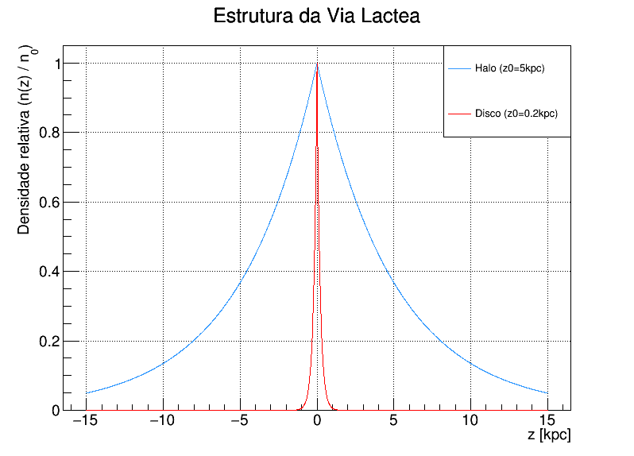

# galactic-density-profile
Simulação em C e plotagem em ROOT do perfil de densidade vertical do disco e halo galáctico através do modelo exponencial de densidade.

## Sobre

O Código utiliza o modelo matemático exponencial para descrever a densidade do meio interestelar no **Disco Galáctico** e no **Halo**. Através dessa modelagem, é possível prever onde ocorrem as interações de espalação, fundamentais para a química da vida.

### Tecnologias Utilizadas
- **Linguagem C**: Para o processamento numérico e geração de dados brutos.
- **ROOT**: Framework de análise de dados para plotagem científica.

## Resultado da Simulação

O gráfico abaixo compara a queda de densidade normalizada entre o disco e o halo:

## Como Executar

### 1. Gerar os dados
Abra o arquivo `main.c` em um compilador como o Dev-C++, por exemplo. Ao executar o código, o terminal vai mostrar as coordenadas $z$ e as densidades correspondentes e logo depois vai gerar automaticamente os arquivos `.txt` contendo essas coordenadas.

Um arquivo será o `dados_densidade_disco.txt` que vai gerar as densidades correspondente ao disco galáctico e outro será o `dados_densidade_halo.txt` correspondente ao halo. 

### 2. Plotar os gráficos 
Com o framework ROOT instalado, abra o terminal na pasta do projeto, inicialize o root apenas digitando `root` e utilize a macro de plotagem.

Dentro da pasta existem 3 macros:

- Para gerar um gráfico do perfil da densidade do halo digite: `.x plotar_densidade_halo.C`
- Para gerar um gráfico do perfil da densidade do disco digite: `.x plotar_densidade_disco.C` 
- Para gerar um gráfico do perfil da densidade do disco e do halo juntos digite: `.x plotar_densidades.C`

Desenvolvido por Emilly Tavares
